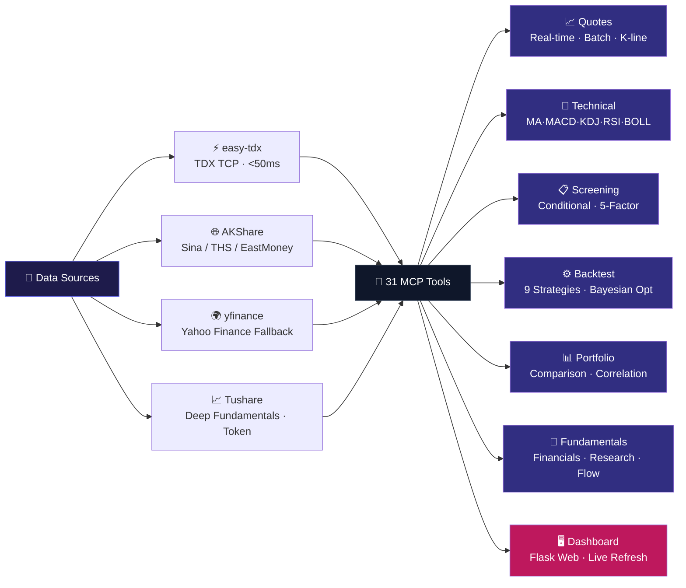

<div align="center">

<!-- 🌊 Top waving dynamic background -->


<!-- ✨ Large animated glowing title -->
<svg width="820" height="130" viewBox="0 0 820 130" xmlns="http://www.w3.org/2000/svg">
  <defs>
    <linearGradient id="brand" x1="0%" y1="0%" x2="100%" y2="0%">
      <stop offset="0%" stop-color="#4F46E5">
        <animate attributeName="stop-color" values="#4F46E5;#0EA5E9;#8B5CF6;#EC4899;#4F46E5" dur="6s" repeatCount="indefinite"/>
      </stop>
      <stop offset="50%" stop-color="#0EA5E9">
        <animate attributeName="stop-color" values="#0EA5E9;#8B5CF6;#EC4899;#4F46E5;#0EA5E9" dur="6s" repeatCount="indefinite"/>
      </stop>
      <stop offset="100%" stop-color="#8B5CF6">
        <animate attributeName="stop-color" values="#8B5CF6;#EC4899;#4F46E5;#0EA5E9;#8B5CF6" dur="6s" repeatCount="indefinite"/>
      </stop>
    </linearGradient>
    <filter id="glow" x="-20%" y="-20%" width="140%" height="140%">
      <feGaussianBlur stdDeviation="4" result="coloredBlur"/>
      <feMerge>
        <feMergeNode in="coloredBlur"/>
        <feMergeNode in="SourceGraphic"/>
      </feMerge>
    </filter>
    <filter id="glow2" x="-20%" y="-20%" width="140%" height="140%">
      <feGaussianBlur stdDeviation="8" result="coloredBlur"/>
      <feMerge>
        <feMergeNode in="coloredBlur"/>
        <feMergeNode in="SourceGraphic"/>
      </feMerge>
    </filter>
  </defs>
  <text x="50%" y="88" text-anchor="middle" font-size="80" font-weight="800" letter-spacing="-3" font-family="-apple-system,BlinkMacSystemFont,Segoe UI,Helvetica,Arial,sans-serif" fill="url(#brand)" filter="url(#glow2)">
    mcp-markets
    <animate attributeName="opacity" values="0.8;1;0.8" dur="3s" repeatCount="indefinite"/>
  </text>
  <text x="50%" y="88" text-anchor="middle" font-size="80" font-weight="800" letter-spacing="-3" font-family="-apple-system,BlinkMacSystemFont,Segoe UI,Helvetica,Arial,sans-serif" fill="url(#brand)" filter="url(#glow)">
    mcp-markets
    <animate attributeName="opacity" values="0.9;1;0.9" dur="3s" repeatCount="indefinite"/>
  </text>
</svg>

<!-- 💫 Animated typing subtitle -->


<p align="center">
  <a href="https://pypi.org/project/mcp-markets/"></a>
  <a href="https://pypi.org/project/mcp-markets/"></a>
  <a href="https://github.com/ojkkk/mcp-finance"></a>
  <a href="LICENSE"></a>
</p>

<p align="center">
  
  
  
  
  
</p>

<!-- 🎬 Animated scrolling capability tags -->


</div>

<!-- Bottom wave -->


---

## ⚡ Quick Start

```bash
pip install mcp-markets

# Mode 1: Run as an MCP Server (for Claude / Codex / Cursor)
python -m mcp_finance.server

# Mode 2: Launch the built-in Web Dashboard
mcp-dashboard              # default http://localhost:8080
```

> Python 3.10+ · Zero config · Optional `TUSHARE_TOKEN` env var for advanced fundamentals

---

## ✨ Capabilities at a Glance

| Module | Capability | Highlight |
|--------|------------|-----------|
| 📈 **Real-time Quotes** | A-Share / HK / US / Futures / Indices | easy-tdx millisecond-level with tri-source fallback |
| 📊 **K-line Data** | Daily / Weekly / Monthly / Minute bars, adj. | 800 bars for A-shares, yfinance fallback for HK/US |
| 🔬 **Technical Analysis** | MA·MACD·KDJ·RSI·BOLL·WR·BIAS | Auto-detect golden/dead cross & overbought/oversold |
| 🔍 **Stock Screener** | 11-dimension filter + 5-factor ranking | Momentum · Value · Quality · Growth · Volatility |
| 🧪 **Backtesting** | 9 strategies + parameter optimization | Backtrader event-driven, 125× performance boost |
| 💼 **Portfolio** | Multi-stock comparison + correlation + portfolio backtest | Equal-weight or custom weights |
| 🏢 **Fundamentals** | Financials / Holdings / Research / Dragon-Tiger | AKShare + Tushare dual source |
| 🖥️ **Web Dashboard** | Flask real-time dashboard | Plotly + ECharts interactive charts |

---

## 🏗️ Four-Source Architecture



---

## 🎯 All 31 MCP Tools

### Quotes & Market Data

| Tool | Description | Data Source | Latency |
|------|-------------|-------------|---------|
| `get_realtime_quote` | Single-stock real-time quote (price / change / volume ratio / turnover) | easy-tdx → AKShare → yfinance | < 100ms |
| `batch_quotes` | Batch real-time quotes for multiple stocks | easy-tdx | < 1s / batch |
| `get_kline` | Daily / Weekly / Monthly K-line with forward/backward adjust | easy-tdx (A) / AKShare+yfinance (HK/US) | < 500ms |
| `get_minute_kline` | 1/5/15/30/60 minute K-line (A-shares only) | easy-tdx | < 200ms |
| `get_market_indices` | A-share / HK / US market indices | easy-tdx → AKShare | < 500ms |
| `get_futures_list` | China commodity & index futures main contracts | AKShare Sina | ~1s |
| `search_stock` | Fuzzy search by code or name | Local mapping | Instant |

### Technical Analysis

| Tool | Description |
|------|-------------|
| `get_technical_indicators` | MA·MACD·KDJ·RSI·BOLL·WR·BIAS + auto signal detection |
| `plot_kline` | Interactive candlestick HTML with moving averages, volume, MACD/KDJ/RSI sub-charts |

### Screening & Analysis

| Tool | Description |
|------|-------------|
| `stock_screener` | 11-dimension conditional screening (change / volume ratio / turnover / PE / PB / ROE / market cap…) |
| `factor_screener` | 5-factor composite scoring & ranking (momentum · value · quality · growth · volatility) |
| `analyze_stock` | One-stop stock analysis report (quote + technicals + financials + score 0-100) |
| `compare_stocks` | Multi-stock comparison ranked by score |
| `correlation_matrix` | Return correlation matrix for diversification |

### Backtesting & Optimization

| Tool | Description | Strategies |
|------|-------------|------------|
| `backtest_strategy` | Single-stock strategy backtest | MA Cross · MACD · RSI · KDJ · BOLL · Turtle · Vol Trend · Mean Reversion · Custom Combo |
| `optimize_strategy` | Grid search / Optuna TPE Bayesian optimization | Auto-pruning + parameter importance |
| `walk_forward` | Walk-Forward robustness test | Anti-overfitting |
| `monte_carlo_test` | Monte Carlo simulation | Strategy robustness evaluation |
| `portfolio_backtest` | Multi-stock portfolio backtest | Custom weights / equal weight |

### Market Intelligence

| Tool | Description |
|------|-------------|
| `get_sector_ranking` | Industry / Concept / Region sector rankings |
| `get_north_flow` | North/South-bound capital flow (Stock Connect) |
| `get_fund_flow` | Individual stock fund flow (easy-tdx millisecond-level) |
| `get_dragon_tiger` | Dragon & Tiger list (broker buy/sell details) |
| `get_block_trades` | Block trade details |
| `get_margin_trading` | Margin trading & short selling data |
| `get_macro_data` | China macroeconomics (GDP / CPI / PMI / M2 / FX reserves) |

### Fundamentals

| Tool | Description |
|------|-------------|
| `get_financials` | 5 categories, 19+ indicators (core / profitability / growth / risk / operations) |
| `get_institutional_holdings` | Top 10 shareholders & institutional holdings |
| `get_research_reports` | Analyst research reports (ratings + price targets) |
| `comparison_chart` | Multi-stock normalized comparison chart (interactive HTML) |
| `test_data_sources` | One-click diagnostic of all data source availability |

---

## 🖥️ Web Dashboard

Built-in Flask dashboard that visualizes all MCP tool capabilities.

```bash
mcp-dashboard              # http://localhost:8080
mcp-dashboard 3000         # custom port
```

| Page | Route | Features |
|------|-------|----------|
| **Market Overview** | `/` | Indices · Hot stocks · Sector rankings · North flow · K-line lookup · Search |
| **Screener** | `/screener` | 5-factor ranking + 11-dimension conditional screening |
| **Backtest** | `/backtest` | 9 strategies · Grid / Bayesian optimization · Walk-Forward · Monte Carlo |

> Responsive layout · Plotly / ECharts interactive charts · Live quote refresh

---

## 🔌 MCP Client Setup

<details>
<summary><b>Claude Desktop</b></summary>

```json
{
  "mcpServers": {
    "mcp-finance": {
      "command": "python",
      "args": ["-m", "mcp_finance.server"]
    }
  }
}
```
</details>

<details>
<summary><b>Codex</b></summary>

```bash
codex mcp add mcp-finance -- python -m mcp_finance.server
```
</details>

<details>
<summary><b>Cursor / VS Code</b></summary>

```json
{
  "mcpServers": {
    "mcp-finance": {
      "type": "stdio",
      "command": "python",
      "args": ["-m", "mcp_finance.server"]
    }
  }
}
```
</details>

> **Optional: Tushare fundamentals** — Set `TUSHARE_TOKEN=your_token` env var. [Register free](https://tushare.pro). Falls back gracefully without it.

---

## 🧪 Development & Testing

```bash
git clone https://github.com/ojkkk/mcp-finance.git
cd mcp-finance
pip install -e ".[dev]"

# Run tests
pytest tests/ -v

# Lint
ruff check mcp_finance/
```

---

## 🌟 AI Conversation Examples

| Scenario | Natural Language Query |
|----------|------------------------|
| Quote | "What's the price of Moutai (600519)?" / "How are Tencent HK and Apple US doing today?" |
| Technical | "Is Moutai's MACD golden cross? What's the RSI?" |
| Screening | "Find A-shares up >3%, volume ratio >1.5, PE <30" / "Top 20 by 5-factor ranking" |
| Backtest | "Backtest MA cross (5,20) on Moutai for 2024" / "Find the best MACD params for Moutai" |
| Portfolio | "Backtest equal-weight portfolio of Moutai + CATL + CMB for the past year" |
| Analysis | "Give me a comprehensive analysis of Moutai" / "Compare Moutai, Wuliangye, Luzhou Laojiao" |
| Macro | "Show me recent China CPI data" / "What is north-bound capital buying recently?" |
| Research | "Latest analyst ratings for Moutai" |

---

## ⚠️ Disclaimer

> **This tool is for educational purposes only. All data is for reference and does not constitute investment advice.**

- Data is sourced from third-party public APIs and web scraping, with **no guarantee of accuracy, completeness, or timeliness**
- **No proprietary data sources**; all data depends on easy-tdx (reverse-engineered TDX protocol), AKShare (web scraping), yfinance, and Tushare
- **No commercial data license**; personal non-commercial use is acceptable, **commercial use carries copyright and compliance risks**
- Backtest results do not predict future performance
- **The author bears no responsibility for any investment losses** · Invest at your own risk

---

## 📄 License

MIT © [mcp-markets](https://github.com/ojkkk/mcp-finance)
