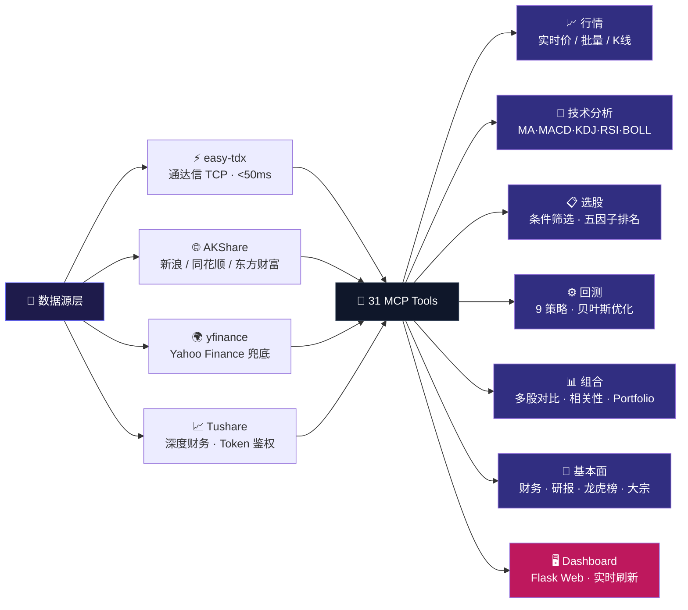

<div align="center">

<!-- 🌊 顶部波浪动态背景 -->


<!-- ✨ 超大动态发光标题 -->
<svg width="780" height="130" viewBox="0 0 780 130" xmlns="http://www.w3.org/2000/svg">
  <defs>
    <linearGradient id="brand" x1="0%" y1="0%" x2="100%" y2="0%">
      <stop offset="0%" stop-color="#4F46E5">
        <animate attributeName="stop-color" values="#4F46E5;#0EA5E9;#8B5CF6;#EC4899;#4F46E5" dur="6s" repeatCount="indefinite"/>
      </stop>
      <stop offset="50%" stop-color="#0EA5E9">
        <animate attributeName="stop-color" values="#0EA5E9;#8B5CF6;#EC4899;#4F46E5;#0EA5E9" dur="6s" repeatCount="indefinite"/>
      </stop>
      <stop offset="100%" stop-color="#8B5CF6">
        <animate attributeName="stop-color" values="#8B5CF6;#EC4899;#4F46E5;#0EA5E9;#8B5CF6" dur="6s" repeatCount="indefinite"/>
      </stop>
    </linearGradient>
    <filter id="glow" x="-20%" y="-20%" width="140%" height="140%">
      <feGaussianBlur stdDeviation="4" result="coloredBlur"/>
      <feMerge>
        <feMergeNode in="coloredBlur"/>
        <feMergeNode in="SourceGraphic"/>
      </feMerge>
    </filter>
    <filter id="glow2" x="-20%" y="-20%" width="140%" height="140%">
      <feGaussianBlur stdDeviation="8" result="coloredBlur"/>
      <feMerge>
        <feMergeNode in="coloredBlur"/>
        <feMergeNode in="SourceGraphic"/>
      </feMerge>
    </filter>
  </defs>
  <text x="50%" y="88" text-anchor="middle" font-size="80" font-weight="800" letter-spacing="-3" font-family="-apple-system,BlinkMacSystemFont,Segoe UI,Helvetica,Arial,sans-serif" fill="url(#brand)" filter="url(#glow2)">
    mcp-markets
    <animate attributeName="opacity" values="0.8;1;0.8" dur="3s" repeatCount="indefinite"/>
  </text>
  <text x="50%" y="88" text-anchor="middle" font-size="80" font-weight="800" letter-spacing="-3" font-family="-apple-system,BlinkMacSystemFont,Segoe UI,Helvetica,Arial,sans-serif" fill="url(#brand)" filter="url(#glow)">
    mcp-markets
    <animate attributeName="opacity" values="0.9;1;0.9" dur="3s" repeatCount="indefinite"/>
  </text>
</svg>

<!-- 💫 动态打字副标题 -->


<p align="center">
  <a href="https://pypi.org/project/mcp-markets/"></a>
  <a href="https://pypi.org/project/mcp-markets/"></a>
  <a href="https://github.com/ojkkk/mcp-finance"></a>
  <a href="LICENSE"></a>
</p>

<p align="center">
  
  
  
  
  
</p>

<!-- 🎬 动态滚动能力标签 -->


</div>

<!-- 底部波浪 -->


---

## ⚡ 快速开始

```bash
pip install mcp-markets

# 方式一：作为 MCP Server 运行（供 Claude / Codex / Cursor 调用）
python -m mcp_finance.server

# 方式二：启动内置 Web Dashboard
mcp-dashboard              # 默认 http://localhost:8080
```

> Python 3.10+ · 零配置即可使用 · 可选设置 `TUSHARE_TOKEN` 环境变量启用高级财务数据

---

## ✨ 核心能力一览

| 模块 | 功能 | 亮点 |
|------|------|------|
| 📈 **实时行情** | A股/港股/美股/期货/指数 | easy-tdx 毫秒级，三源自动降级 |
| 📊 **K线数据** | 日/周/月/分钟 K线，前/后复权 | A股 800 条，港美股 yfinance 兜底 |
| 🔬 **技术指标** | MA·MACD·KDJ·RSI·BOLL·WR·BIAS | 金叉/死叉/超买超卖自动识别 |
| 🔍 **选股器** | 11 维条件筛选 + 五因子排名 | 动量·价值·质量·增长·波动 |
| 🧪 **策略回测** | 9 大策略 + 参数优化 | Backtrader 事件驱动，125× 性能提升 |
| 💼 **组合分析** | 多股对比 + 相关性矩阵 + 组合回测 | 支持等权/自定义权重 |
| 🏢 **基本面** | 财务指标 / 机构持仓 / 研报 / 龙虎榜 | AKShare + Tushare 双源 |
| 🖥️ **Web 看板** | Flask 实时行情 Dashboard | Plotly + ECharts 交互图表 |

---

## 🏗️ 四数据源架构



---

## 🎯 全部 31 个 MCP 工具

### 行情报价

| 工具 | 功能 | 数据源 | 延迟 |
|------|------|--------|------|
| `get_realtime_quote` | 单股实时行情（现价/涨跌幅/量比/换手率） | easy-tdx → AKShare → yfinance | < 100ms |
| `batch_quotes` | 批量查询多只股票行情 | easy-tdx | < 1s / batch |
| `get_kline` | 日/周/月 K线 + 前/后复权 | easy-tdx (A股) / AKShare+yfinance (港美股) | < 500ms |
| `get_minute_kline` | 1/5/15/30/60 分钟 K线（仅 A股） | easy-tdx | < 200ms |
| `get_market_indices` | A股 / 港股 / 美股 大盘指数 | easy-tdx → AKShare | < 500ms |
| `get_futures_list` | 国内期货主力合约行情 | AKShare 新浪 | ~1s |
| `search_stock` | 代码/名称模糊搜索 | 本地映射 | 即时 |

### 技术分析

| 工具 | 功能 |
|------|------|
| `get_technical_indicators` | MA·MACD·KDJ·RSI·BOLL·WR·BIAS + 金叉/死叉/超买超卖/均线排列自动识别 |
| `plot_kline` | 交互式 K线 HTML（蜡烛图+均线+成交量+MACD/KDJ/RSI 副图） |

### 选股 & 分析

| 工具 | 功能 |
|------|------|
| `stock_screener` | 11 维条件选股（涨跌幅/量比/换手率/PE/PB/ROE/市值…） |
| `factor_screener` | 五因子综合打分排名（动量·价值·质量·增长·波动） |
| `analyze_stock` | 一站式个股分析报告（行情+技术+财务+综合评分 0-100） |
| `compare_stocks` | 多股横向对比，按评分排名 |
| `correlation_matrix` | 收益率相关性矩阵（辅助分散投资） |

### 回测 & 优化

| 工具 | 功能 | 策略 |
|------|------|------|
| `backtest_strategy` | 个股策略回测 | 双均线·MACD·RSI·KDJ·BOLL·海龟·波动率趋势·均值回归·自定义组合 |
| `optimize_strategy` | 网格扫描 / Optuna TPE 贝叶斯优化 | 自动剪枝 + 参数重要性分析 |
| `walk_forward` | Walk-Forward 稳健性检验 | 防止过拟合 |
| `monte_carlo_test` | 蒙特卡洛模拟 | 评估策略稳健性 |
| `portfolio_backtest` | 多股组合回测 | 自定义权重 / 等权分配 |

### 市场数据

| 工具 | 功能 |
|------|------|
| `get_sector_ranking` | 行业/概念/地域板块涨跌排行 |
| `get_north_flow` | 北向/南向资金流向 |
| `get_fund_flow` | 个股主力资金净流入（easy-tdx 毫秒级） |
| `get_dragon_tiger` | 龙虎榜（营业部买卖明细） |
| `get_block_trades` | 大宗交易明细 |
| `get_margin_trading` | 融资融券数据 |
| `get_macro_data` | 中国宏观经济（GDP/CPI/PMI/M2/外汇储备） |

### 基本面

| 工具 | 功能 |
|------|------|
| `get_financials` | 5 大类 19+ 指标（核心/盈利/成长/风险/营运） |
| `get_institutional_holdings` | 十大流通股东 / 机构持仓 |
| `get_research_reports` | 机构研报（评级+目标价） |
| `comparison_chart` | 多股走势对比图（归一化交互 HTML） |
| `test_data_sources` | 一键诊断所有数据源可用性 |

---

## 🖥️ Web Dashboard

内置 Flask Web 界面，可视化所有 MCP 工具能力。

```bash
mcp-dashboard              # http://localhost:8080
mcp-dashboard 3000         # 指定端口
# 或双击 start_dashboard.bat（Windows）
```

| 页面 | 路由 | 功能 |
|------|------|------|
| **行情总览** | `/` | 大盘指数 · 热门股票 · 板块排行 · 北向资金 · K线速查 · 股票搜索 |
| **选股器** | `/screener` | 五因子排名 · 条件选股（11维）· 实时筛选 |
| **策略回测** | `/backtest` | 9 策略回测 · 网格/贝叶斯优化 · Walk-Forward · 蒙特卡洛 |

> 响应式布局 · Plotly / ECharts 交互图表 · 实时行情自动刷新

---

## 🔌 配置 MCP 客户端

<details>
<summary><b>Claude Desktop</b></summary>

```json
{
  "mcpServers": {
    "mcp-finance": {
      "command": "python",
      "args": ["-m", "mcp_finance.server"]
    }
  }
}
```
</details>

<details>
<summary><b>Codex</b></summary>

```bash
codex mcp add mcp-finance -- python -m mcp_finance.server
```
</details>

<details>
<summary><b>Cursor / VS Code</b></summary>

```json
{
  "mcpServers": {
    "mcp-finance": {
      "type": "stdio",
      "command": "python",
      "args": ["-m", "mcp_finance.server"]
    }
  }
}
```
</details>

> **可选：启用 Tushare 财务数据** — 设置环境变量 `TUSHARE_TOKEN=你的token`（注册 [tushare.pro](https://tushare.pro) 免费获取）。未设置时自动降级，不影响基础功能。

---

## 🧪 测试 & 开发

```bash
git clone https://github.com/ojkkk/mcp-finance.git
cd mcp-finance
pip install -e ".[dev]"

# 运行测试
pytest tests/ -v

# 代码检查
ruff check mcp_finance/
```

---

## 🌟 AI 对话示例

| 场景 | 自然语言提问 |
|------|------------|
| 行情 | "茅台现在什么价？" / "腾讯港股和苹果美股今天表现如何？" |
| 技术分析 | "茅台 MACD 金叉了吗？RSI 到什么位置了？" |
| 选股 | "找涨超 3%、量比>1.5、PE<30 的股票" / "五因子排名前 20" |
| 回测 | "双均线(5,20)回测茅台 2024 年全年" / "找茅台最优 MACD 参数" |
| 组合 | "茅台+宁德+招行等权组合回测近一年" |
| 分析 | "给我茅台的综合分析报告" / "对比茅台、五粮液、老窖" |
| 市场 | "最近 CPI 数据" / "北向资金最近在买什么？" |
| 研报 | "看看机构对茅台的最新评级" |

---

## ⚠️ 免责声明

> **本工具仅供学习交流，所有数据仅供参考，不构成任何投资建议。**

- 数据来源于第三方公开接口与网页爬虫，**不作准确性、完整性、及时性保证**
- **无自有数据源**，全部依赖 easy-tdx（通达信公开 TCP）/ AKShare（网页爬虫）/ yfinance / Tushare
- 数据**无合规商业授权**，个人非商用无问题，**企业商用存在版权与合规风险**
- 回测结果不代表未来表现，**历史收益不预示未来收益**
- **作者不对任何投资损失承担责任** · 投资有风险，入市需谨慎

---

## 📄 License

MIT © [mcp-markets](https://github.com/ojkkk/mcp-finance)
